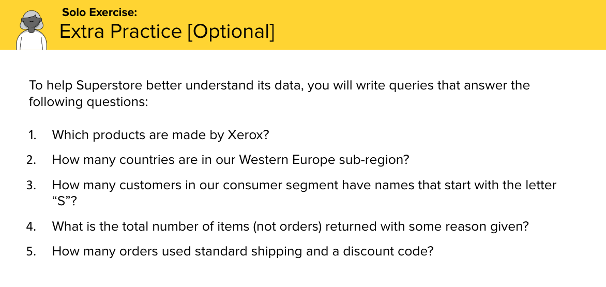

# SQL Lab


# Where In The World Is Carmen Sandiego?

## Introduction

#### Use SQL to find Carmen Sandiego

We're going to use what we've learned already about querying a database using SQL commands to to chase down and capture an elusive and world-renowned thief, Carmen Sandiego!

**This is an excellent lab to collaborate with classmates on!**

## Setup

1. Fork the repository to your personal GA GitHub enterprise account

2. In your fork go to the code button and select ssh option and copy the url to the clipboard by clicking the clipboard icon.

4. Inside of your terminal `cd` into your `mef` folder

3. Clone the fork of your repository with the `git clone <pasturlfromclipboardnotthistext>` command in your terminal.

This lab requires `*.sql` files used to create a database with tables that contain data about locations across the 🌎...

NOTE: Make sure you `cd` into the `carmen-sandiego-sql-lab` folder before proceeding.

4. Inside of your terminal run the command `code .` in order to open the vscode editor


5. Open a terminal session in vscode (`control + backtick`) and run `ls` - you should see three files: `clues.sql`, `world.sql` & `solution.md`.

6. Start the `psql` interactive terminal (the password is `postgres`):
    ```
    sudo -u postgres psql
    ```

7. Create a database named `carmen` and connect to it:
    ```sql
    CREATE DATABASE carmen;
    \c carmen
    ```

8. Run the following command to run **world.sql** that creates `city`, `country` & `countrylanguage` tables and seeds their data

    ```sql
    \i world.sql
    ```

## Exercises

The goal is to figure out what city Carmen Sandiego is heading to so that she can be met by the proper authorities.

You'll be writing SQL queries within **clues.sql** to answer each clue.

Check your progress by running the queries that you write in **clues.sql** using:
    ```
    \i clues.sql
    ```

## Hints

- Use the psql `\d` & `\d tablename` commands to list & display the schema of each of the three tables.

- Google and collaborate to reach the goal of finding out where Carmen's destination is.

- For example, you'll certainly need to know about the [ORDER BY](http://www.postgresqltutorial.com/postgresql-order-by/) clause.

- Try not to peek too much at **solution.sql**.

- clear your psql interactive terminal use the `\! clear` command

## Additional Resources

- [PostgreSQL official documentation](http://www.postgresql.org/docs/)

## Encore

- If you finish this exercise and want to learn more about SQL, do some of [these exercises here](https://pgexercises.com/).

- Or, you can try the PG Admin additional challenges in the slide below:

    - [PG Admin URL](https://analyticsga-global.generalassemb.ly/)
    - [Secondary PG Admin URL](https://pgadmin-staging.generalassemb.ly/)
    - Username: `analytics_student@generalassemb.ly`
    - Password: `analyticsga`


    
